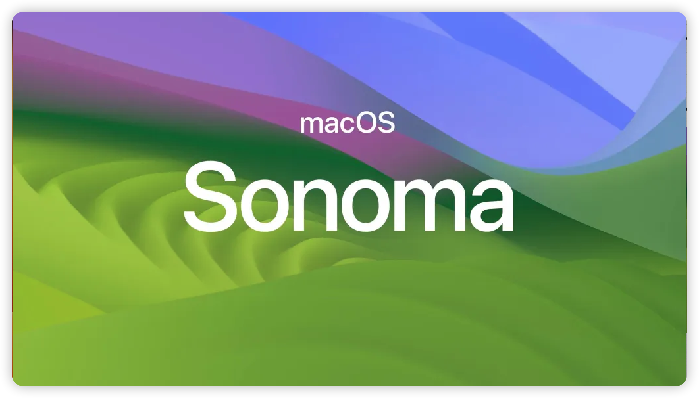

# TUF-GAMING-B760M-PLUS-WIFI-i7-14700KF-RX6950XT-Hackintosh

---

### branch:
   - main: [intel wifi](https://github.com/cuihairu/TUF-GAMING-B760M-PLUS-WIFI-i714700KF-RX6950XT-Hackintosh/tree/main)
   - broadcom: [broadcom wifi](https://github.com/cuihairu/TUF-GAMING-B760M-PLUS-WIFI-i714700KF-RX6950XT-Hackintosh/tree/broadcom) 

### Information 

- macOS: [Sonoma](https://www.apple.com/macos/sonoma/)
- bootloader: [OpenCore](https://github.com/acidanthera/OpenCorePkg/releases/latest)

---

### Hardware

| Component    | Variant                   | Link                                                                                                                                         |
|:------------:|:-------------------------:|:--------------------------------------------------------------------------------------------------------------------------------------------:|
| Mainboard    | TUF GAMING B760M-PLUS WIFI  | [www.asus.com](https://www.asus.com/motherboards-components/motherboards/tuf-gaming/tuf-gaming-b760m-plus-wifi/)                                                                     |
| Processor    | Intel Core i7 14700KF      | [ark.intel.com](https://www.intel.com/content/www/us/en/products/sku/236789/intel-core-i7-processor-14700kf-33m-cache-up-to-5-60-ghz/specifications.html)     |
| DDR4 RAM     | Corsair 128GB             | [www.corsair.com](https://www.corsair.com/ja/zh/%E7%B1%BB%E5%88%AB/%E4%BA%A7%E5%93%81/%E5%86%85%E5%AD%98/VENGEANCE-LPX/p/CMK128GX4M4A2666C16)|
| NVMe SSD     | HP EX950 M.2 2TB          | [hp.biwintech.com](https://hp.biwintech.com/products/hpex950m.2/)                                                                                           |
| Graphics     | AMD Radeon RX 6950xt      | [www.amd.com](https://www.amd.com/en/products/graphics/desktops/radeon/6000-series/amd-radeon-rx-6950-xt.html)                                                                |
| Audio        | Realtek ALC897          | [Supported-codecs](https://github.com/acidanthera/AppleALC/wiki/Supported-codecs)                                                            |
| WiFi / BT    | Intel AX201/BCM94360CD    | [www.intel.com](https://www.intel.com/content/www/us/en/products/sku/130293/intel-wifi-6-ax201-gig/specifications.html)                      |
| PC Case      | phanteks PH-ES518XTG      | [phanteks.cn](https://phanteks.cn/Evolv_Series/PH-ES518XTG)                                                                                  |

[Specification](https://www.msi.cn/Motherboard/MEG-Z490-GODLIKE/Specification)

---

### BIOS 

#### === Disable ===
- Fast Boot
- Secure Boot
- Serial/COM Port
- Parallel Port
- VT-d (can be enabled if you set DisableIoMapper to YES)
- Intel VMD(If your BIOS has Intel VMD, you must disable it.)
- Compatibility Support Module (CSM) (Must be off in most cases, GPU errors/stalls like gIO are common when this option is enabled)
- Thunderbolt (For initial install, as Thunderbolt can cause issues if not setup correctly)
- Intel SGX
- Intel Platform Trust
- CFG Lock (MSR 0xE2 write protection) (This must be off, if you can't find the option then enable AppleXcpmCfgLock under Kernel -> Quirks. Your hack will not boot with CFG-Lock enabled)

#### === Enable ===
- VT-x
- Above 4G Decoding
- Resizable BAR(Optional,Set config.plist-Booter-ResizeAppleGpuBars to 0 if Enabled, or -1 if Disabled.)
- Hyper-Threading
- Execute Disable Bit
- EHCI/XHCI Hand-off
- OS type: Windows 8.1/10 UEFI Mode (some motherboards may require "Other OS" instead)
- DVMT Pre-Allocated(iGPU Memory): 64MB or higher
- SATA Mode: AHCI

#### Kexts

|             Kext             |   Version    |                            Author                            |
| :--------------------------: | :----------: | :----------------------------------------------------------: |
|    XHCI-unsupported.kext     |    v0.9.2    | [RehabMan/OS-X-USB-Inject-All](https://github.com/RehabMan/OS-X-USB-Inject-All/tree/master/XHCI-unsupported.kext) |
|          Lilu.kext           |    v1.6.8    | [acidanthera/Lilu](https://github.com/acidanthera/Lilu/releases) |
|      SMCProcessor.kext       |    v1.3.3    | [acidanthera/VirtualSMC](https://github.com/acidanthera/VirtualSMC/releases) |
|       SMCSuperIO.kext        |    v1.3.3    | [acidanthera/VirtualSMC](https://github.com/acidanthera/VirtualSMC/releases) |
|       VirtualSMC.kext        |    v1.3.3    | [acidanthera/VirtualSMC](https://github.com/acidanthera/VirtualSMC/releases) |
|      RadeonSensor.kext       |    v2.2.0    | [ChefKissInc/RadeonSensor](https://github.com/ChefKissInc/RadeonSensor/releases) |
|     RestrictEvents.kext      |    v1.1.4    | [acidanthera/RestrictEvents](https://github.com/acidanthera/RestrictEvents) |
|         NVMeFix.kext         |    v1.1.1    | [acidanthera/NVMeFix](https://github.com/acidanthera/NVMeFix) |
|     AppleALC.kext            |    v1.9.1    | [acidanthera/AppleALC](https://github.com/acidanthera/AppleALC/releases)          |
|     CpuTscSync.kext          |    v1.1.0    | [acidanthera/CpuTscSync](https://github.com/acidanthera/CpuTscSync/releases)      |
| HibernationFixup.kext        |    v1.5.1    | [acidanthera/HibernationFixup](https://github.com/acidanthera/HibernationFixup/releases)    |
|       AirpotItlwm.kext       |    v2.3.0    | [OpenIntelWireless/itlwm](https://github.com/OpenIntelWireless/itlwm/releases) |
| IntelBluetootchFirmware.kext |    v2.4.0    | [OpenIntelWireless/IntelBluetoothFirmware](https://github.com/OpenIntelWireless/IntelBluetoothFirmware/releases) |
|     IntelBTPatcher.kext      |    v2.4.0    | [OpenIntelWireless/IntelBTPatcher.kext](https://github.com/OpenIntelWireless/IntelBluetoothFirmware/releases) |
|      BlueToolFixup.kext      |    v2.6.8    | [acidanthera/BrcmPatchRAM](https://github.com/acidanthera/BrcmPatchRAM/releases) |
|      FeatureUnlock.kext      |    v1.1.5    | [acidanthera/FeatureUnlock](https://github.com/acidanthera/FeatureUnlock/releases) |
|       USBToolBox.kext        |    v1.1.1    | [USBToolBox/kext](https://github.com/USBToolBox/kext/releases) |
|         UTBMap.kext          |    v1.1.1    | [USBToolBox/tool](https://github.com/USBToolBox/tool)     |
|      WhateverGreen.kext      |    v1.6.7    | [acidanthera/WhateverGreen/](https://github.com/acidanthera/WhateverGreen/releases) |
|    AirportBrcmFixup.kext     |    v2.1.8    | [acidanthera/AirportBrcmFixup](https://github.com/acidanthera/AirportBrcmFixup/releases) |
|LucyRTL8125Ethernet.kext| v1.2.0d5 | [Mieze/LucyRTL8125Ethernet](https://github.com/Mieze/LucyRTL8125Ethernet/releases) |

App:

|     App      | Version | Author                                                       |
| :----------: | :-----: | ------------------------------------------------------------ |
|   HeliPort   | v2.0.0-alpha | [OpenIntelWireless/HeliPort](https://github.com/OpenIntelWireless/HeliPort/releases) |

---

### Utils

| Name                                 | Version      | Author                                                                                                             |
|:------------------------------------:|:------------:|:------------------------------------------------------------------------------------------------------------------:|
| ioreg                                | v3.0.2       | [khronokernel/IORegistryClone](https://github.com/khronokernel/IORegistryClone/blob/master/ioreg-302.zip)          |
| Hackintool                           | v4.0.3       | [benbaker76/Hackintool](https://github.com/benbaker76/Hackintool/releases)                                         |
| OpenCore Configurator                | v2.76.10     | [occ](https://mackie100projects.altervista.org/download-opencore-configurator/)                                    |
| MonitorControl                       | v4.2.0       | [MonitorControl](https://github.com/MonitorControl/MonitorControl/releases)                                        |

---

### Update macOS

Check the official update-guide: [OpenCore-Post-Install/update](https://dortania.github.io/OpenCore-Post-Install/universal/update.html)

1. Backup
   - Full system backup with `Time Machine` or similar software
   - Copy current EFI to OpenCore USB-Drive for recovery purpose
2. Download
   - Latest version of OpenCore and replace files in EFI
   - Updates for all installed kexts and replace in EFI
3. Reboot
   - Boot with updated OpenCore version and kexts
   - If the system doesn't boot, use OpenCore USB-Drive to roll back
4. Update
   - Start macOS Update from `System Settings` -> `Software Update`
   - With OpenCore the update process should work automatically
   - If `Software Update` shows `Mac version is up to date`, download macOS Installer from AppStore and start the update manually

If the system doesn't boot, try to fix the problem or revert to the latest EFI or system-backup.
